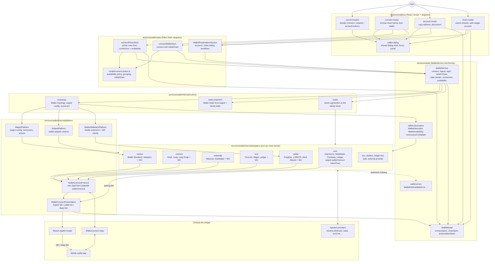
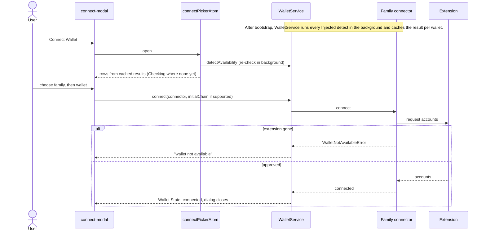

# Wallet handling

How the widget finds wallets, connects them, keeps them connected, and signs
with them. Ownership and dependency rules are in
`packages/widget/ARCHITECTURE.md`; the WalletConnect decision is
[ADR 0010](adr/0010-widget-owns-the-walletconnect-protocol.md). Paths below are
relative to `packages/widget/src`.

## Components



## What each part does

| Part | Responsibility |
|---|---|
| `ui/wallet-dialog` | Radix dialog used by every wallet dialog. Portals into the configured container, carries the theme root, restores focus to the opener, and hides itself (`suspended`) while AppKit or TonConnect's modal is on top. Bottom sheet below 520px, centred dialog above. |
| `ui/connect-modal` | The picker: chain family list, then wallets grouped into "Installed" and catalogue groups. Shows Connect, Install (store link) or a non-interactive Checking row. Footer disclaimer. |
| `ui/account-modal`, `ui/chain-modal` | Account actions and network switching; Ledger chains not yet added route to "add Ledger account". |
| `model/connect-picker.ts` | Plain functions: the availability policy, grouping, first-paint placement, and `connectionChainId` (host `initialChain` when the wallet supports it). |
| `state/wallet-modal.ts` | `connectPickerAtom` and `connectWalletAtom`: shallow adapters between the picker and `WalletService`. |
| `WalletPresentationService` | Feature service for account and chain dialog workflows. |
| `WalletService` | The wallet runtime's single entry point: `connect`, `logout`, `signMessage`, `signTypedData`, `signTransaction`, `switchChain`, `switchAccount`, `addLedgerAccount`, the Wallet State stream, `connectors`, and the per-wallet `availability` cache with `detectAvailability`. |
| `WalletModal` | Open state of the connect and chain dialogs, plus `presentationOpen` while AppKit or TonConnect's modal is visible. |
| `wallet-descriptors.ts` | The owned wallet catalogue format. Each wallet declares `availability`: `Remote` or `Injected { detect, installUrl? }`. `connectorsForWallets` turns descriptors into wagmi connectors. |
| `runtime/bootstrap` | Captures Wallet Topology once (networks, connector mode), builds the wagmi config with all family connectors, and runs wagmi reconnect. |
| `runtime/state-projection` | Derives the authoritative Wallet State from wagmi and family state. |
| `runtime/router` | Sends sign, switch and account requests to the connected family's driver. |
| `WagmiPlatform`, `SolanaPlatform`, `StellarWalletsKitPlatform` | Library integrations owned behind Effect services. |
| `WalletConnectProtocol` | One `SignClient` per page (shared by every widget mount) for every non-EVM family: propose (and resume a pending proposal, or adopt a session approved after the QR was closed), restore sessions, request with Schema-decoded responses, disconnect one topic, report remote session ends per topic. A session is returned only for the namespace the widget proposed it for. Loads the SDK only when a session was approved before or a wallet is chosen. |
| `WalletConnectPresentation` | Shows a pairing link through AppKit (`manualWCControl`, its own inert provider). Cancels when the user closes it; opens wallet deep links. |
| Family adapters | Turn each chain family into wagmi connectors. Extension wallets use their libraries; WalletConnect wallets use the shared protocol (EVM keeps wagmi's own). |

## Main flows

### Opening the picker and connecting an extension



### Connecting over WalletConnect (non-EVM)

```mermaid
sequenceDiagram
  actor U as User
  participant F as Family WC adapter
  participant PR as WalletConnectProtocol
  participant WP as WalletConnectPresentation
  participant AK as AppKit
  participant W as Mobile wallet

  U->>F: choose WalletConnect
  F->>PR: sessions(namespace)
  alt live session exists
    PR-->>F: session (no QR)
  else
    F->>PR: connect(proposal)
    PR->>WP: pairing URI
    WP->>AK: open QR / wallet list (picker suspended)
    U->>W: scan or open deep link
    W-->>PR: approve session
    PR-->>F: session for this namespace
    WP->>AK: close (picker resumes)
  end
  Note over U,AK: Closing AppKit cancels the attempt; retrying resumes the same pending proposal.
  W-->>PR: session_delete / session_expire
  PR-->>F: ended(topic)
  F-->>F: emit wagmi disconnect
```

### After a page reload
Wallet bootstrap runs wagmi reconnect. Each connector answers `isAuthorized`
from its own state: extensions from the injected provider, WalletConnect
families from `WalletConnectProtocol.sessions(namespace)` (a live, unexpired
session the widget approved for that namespace, holding the stored account).
Explicit disconnects leave a marker that stops restoration. Reconnect never
shows a QR.
Cosmos connectors restore the chain they last connected on: extensions save it
in wagmi storage and fall back to a chain cosmos-kit restored; WalletConnect
reuses any live Cosmos session holding a chain's account before proposing.

### Signing
Transaction flows call `WalletService.signTransaction`, the router picks the
connected family's driver, and the driver signs through its extension or
through `WalletConnectProtocol.request` with the family's RPC method.

## Wallet availability policy

| Wallet | Picker shows |
|---|---|
| Remote | Connect |
| Injected, detected | Connect, in "Installed" (decided at first paint of each opening) |
| Injected with store link, desktop, not detected | Install |
| Injected with store link, desktop, still checking | Checking, same row and height |
| Injected without store link, or on mobile, not detected | Hidden |
| Chain family with nothing visible | Hidden |

Rows are never added, removed or reordered while the picker is open on
desktop; a late result only changes the row's action.

## Persisted state

| Key / prefix | Owner | Purpose |
|---|---|---|
| `wc@2:*:stakekit-walletconnect` | WalletConnectProtocol | Non-EVM WalletConnect sessions and pairings |
| `wc@2:*:stakekit-appkit-presentation` | WalletConnectPresentation | AppKit's inert provider; never holds a session |
| `wc@2:*:clientTwo` | wagmi `walletConnect` | EVM WalletConnect sessions |
| `sk-widget@1//walletConnectSessions` | WalletConnectProtocol | Whether to load the SDK on the next page load |
| `sk-widget@1//walletConnectSessionOwner/<topic>` | WalletConnectProtocol | Namespace the topic was proposed for (one key per topic, so tabs never overwrite each other); unowned sessions are never restored. Removed on disconnect, remote end or expiry |
| `wagmi.*` | wagmi and family connectors | Recent connector, per-family connection and disconnect markers |

## Tests

- `tests/utils/wallet-connect.ts`: the real protocol and presentation over a
  fake `SignClient` and fake AppKit; share a store to model a reload.
- `tests/utils/wallet-connect-picker.tsx`: the real picker and runtime with fake
  connectors and injected providers.
- Per family: `tests/providers/wallet/*-wallet-connect.test.ts` and
  `*-wallet-availability.test.ts`.
